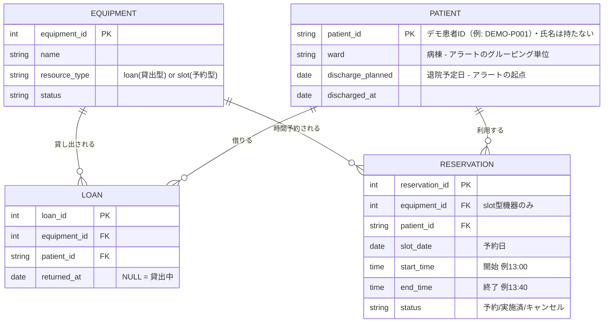

# 病棟備品・リハビリ運用 統合管理システム

医療・リハビリ領域で想定される資源管理の課題を題材にした、ポートフォリオ用のプロトタイプです。
公開版の患者ID・担当者名・病棟名・物品IDはデモ用の識別子に統一しています。実患者・実職員・実施設を示す名称として使用するものではありません。

## 背景：一般化した業務課題

- **リハビリ機器の順番待ち**：機器の台数、患者ごとの希望順、待ち始めた時刻を考慮し、利用順を管理する想定です。
- **病棟備品の貸出**：貸出物品の返却状況を把握し、退院前の確認と回収依頼を支援する想定です。
- **社用車の予約**：定期利用の一括登録と、予約の重複防止・時間変更を支援する想定です。

特定の募集案件の依頼文や施設固有の人数・配置条件は掲載せず、一般化した要件とデモ設定を用いています。画面はサンプルデータで動作し、外部システムとは連携していません。

## 全体構成

```
病棟備品・リハビリ運用 統合管理システム
├── ① 病棟備品貸出管理（DB設計）
│     車椅子・クッション等の "loan型" と
│     物理療法機器の "slot型" を区別したER設計
│
├── ② リハビリ順番待ちボード（実装済み）
│     機器の台数制約・患者ごとの希望順を
│     考慮したリアルタイムスケジューラ
│
├── ③ 退院前 返却チェック（SQLビュー）
│     退院予定日が近く、かつ未返却の貸出物がある
│     患者だけを抽出するアラート
│
└── ④ 社用車 利用ボード（実装済み）
      "slot型"リソース管理のUI実装。
      定期利用の一括登録とダブルブッキングの構造的防止
```

---

## ① 病棟備品貸出管理（DB設計）



**設計のポイント**：車椅子のように「借りたら返すまで専有する」備品（loan型）と、物理療法機器のように「時間枠で予約する」備品（slot型）は、見た目は似ていても管理すべきデータの粒度が違います。`resource_type`でこれを明示的に分けることで、②のリアルタイムスケジューラと③の退院アラートの両方から同じテーブル設計を再利用できるようにしています。

## ② リハビリ順番待ちボード

「先着順」という一見シンプルなルールの裏に、実務では以下の制約が隠れていました。

| 制約 | 実装での対応 |
|---|---|
| 機器ごとに台数が違う（ホットパック複数台 / 平行棒1台） | 機器を `capacity`（同時稼働数）で管理 |
| 「まずホットパックをやりたい」という希望順がある患者 | 選択順を希望順として保持し、順番に消化 |
| 順番にこだわらず早く終わりたい患者もいる | 患者ごとに「希望順厳守」「順不同」を切り替え可能に |
| 機器を待ち始めた"本当の"タイミングが患者ごとに違う | `receivedAt`（来院時刻）ではなく、各項目が「今欲しいもの」になった瞬間の `waitingSince` で公平性を判定 |
| 利用時間と清掃時間が機器ごとに違う | 標準利用時間・標準清掃時間を機器ごとに設定し、患者ごとの利用時間も受付時に変更可能 |
| 清掃状態の更新で通常操作を増やしたくない | 「利用終了」で清掃中へ移し、標準清掃時間の経過後に自動解放。人の操作は清掃延長などの例外時だけに限定 |

最後の点は実装時に見落としていたバグで、レビュー（Claude Fable）の指摘で修正しました。当初は総滞在時間で「要注意」を判定していたため、機器を長時間使い終えた直後の患者が不当に警告表示されるという不具合がありました。「手が空いてからの時間」を別軸で管理する `idleSince` を導入して解消しています。

## ③ 退院前 返却チェック（SQLビュー + 業務フロー）

```sql
CREATE VIEW discharge_alert AS
SELECT
  p.patient_id, p.ward, p.discharge_planned,
  COUNT(l.loan_id) AS unreturned_loan_count,
  GROUP_CONCAT(e.name, ', ') AS unreturned_equipment
FROM PATIENT p
JOIN LOAN l ON l.patient_id = p.patient_id AND l.returned_at IS NULL
JOIN EQUIPMENT e ON e.equipment_id = l.equipment_id
WHERE p.discharged_at IS NULL
  AND julianday(p.discharge_planned) <= julianday('now', '+3 days')
GROUP BY p.patient_id, p.ward, p.discharge_planned
ORDER BY p.discharge_planned ASC;
```

退院3日前までに、未返却の貸出物がある患者だけを抽出します。①のER設計があるからこそ、このビューはJOIN 2本で書けています。

初期プロトタイプは「対応済みボタンを押すと一覧から消える」という一段階のフローでしたが、レビュー（ChatGPT）から「現場では"電話した"と"まだ返ってきていない"の間に段差がある」という指摘を受け、次の3段階に分けました。

```
未対応 → 回収依頼済み → 返却済み
```

画面の「回収を依頼する」は、回収依頼タスクの生成と「回収依頼済み」への状態更新を1回の操作で行います。返却を確認したときは「返却完了」で「返却済み」へ更新します。各操作には担当者名と時刻を記録し、申し送りに使える履歴として残します。病棟ごとにグルーピングし、画面上部に「対応が必要な件数」を表示します。

現在は画面内のサンプルデータでこの流れを疑似的に表現しています。実運用では、貸出時に患者IDと物品IDを `LOAN` で紐づけ、`returned_at IS NULL` の未返却物品だけを退院前の一覧に出す想定です。電子カルテ、院内API、RFIDとの連携は今回のプロトタイプには含めていません。

## ④ 社用車 利用ボード

表計算ソフトで社用車の予定を管理する場面を想定し、次の一般的な課題に対応しています。

| Excel運用の課題 | 実装での対応 |
|---|---|
| 同じ定期利用を各週へ個別入力 | 曜日を複数選択し「毎週繰り返す」で対象日時を一括登録 |
| ダブルブッキングを防ぐ仕組みがない（重複入力できてしまう） | 登録・ドラッグ移動のたびに全対象週×曜日で衝突判定し、重なる場合は登録自体を中止 |
| 定期予定の一部だけ変えたい週がある（休暇・車検など） | 削除・移動のどちらも「この週だけ / 毎週まとめて」を選択可能に（カレンダーアプリと同じ操作粒度） |
| 「今この時間、どの車が空いてるか」を月表から目で探す | 空き枠をタップ→その場のポップアップで登録完了。「空いてる車を探す」ボタンで即答 |

設計面では、利用者のタイプによって入力の起点が違うことに気づき、2つの入口を用意しました。**計画者**（月初にまとめて予定を組む人）は条件（人・曜日・時刻）が先に決まっているためフォーム入力、**即席利用者**（今から車を使いたい人）は空き枠が起点になるため、タイムテーブルの空白を直接タップして登録する方式です。

**設計変遷（v1 → v2）**：本モジュールには訪問予定を中心とした旧試作がありました。v1は「患者の訪問予定」を中心に、移動時間バッファを斜線で分離表示する設計でした。しかし検討の結果、車両管理という目的に対して患者情報も移動の内訳も過剰であり、**「車の空き管理に必要なのは占有時間だけ」**と判断。v2では視点を「スタッフの車利用」に転換し、1ブロック方式に単純化した上で、Excel運用の本当の課題だった定期利用の一括登録とダブルブッキング防止に注力しました。旧試作はローカルの `archive/visit-reservation/` に保管し、現在のアプリとGit公開対象には含めていません。

実装上の教訓として、削除確認に`window.confirm`を使ったところ、サンドボックス環境ではダイアログが表示されず暗黙のfalseが返り、確認なしで削除される不具合が発生しました。ブラウザ標準ダイアログは実行環境によって無効化されるため、業務アプリでは自前のモーダルで確認フローを実装すべき、という学びを得ています。

## 今後の展望（レビューを踏まえた拡張構想）

**最終的な構想は「病院のあらゆる予約を扱えるリソース管理プラットフォーム」です。** 本プロジェクトの4モジュールは一見バラバラですが、①のER図で定義した `resource_type`（loan型/slot型）の視点で見ると、車・リハビリ機器・貸出備品はすべて「有限のリソースを時間軸上で誰かに割り当てる」という同じ問題です。MRI・エコー・会議室・面談室も同じ抽象化で扱えるため、Resourceを統一モデルとして再設計すれば、1つの仕組みで院内のあらゆる予約を管理できます。この気づきは複数AIレビュー（ChatGPT）との対話から得たものです。

ER図とSQLビューは設計例であり、現在のReact画面はデモデータで動作します。以下は未実装の連携構想です。

```
ER図
  ↓
SQLビュー（discharge_alert）
  ↓
REST API（FastAPIなど）
  ↓
React画面（現状ここまで）
  ↓
病棟への通知（LINE WORKS / Teams 連携）
  ↓
QRコードでの返却処理（読み取るだけで一覧から消える）
  ↓
DB更新
```

- ブラウザストレージ（`window.storage`）を用いたセッション永続化
- 利用実績の保持。現在のプロトタイプは削除・変更で過去の記録が消えるが、実務では「先週の水曜、3号車を誰が使っていたか」に答えられることが重要（車両の傷や駐車違反の通知など、後から利用者を特定したい場面は現実に起こる）。Excelの月別シートが自然に持っていたこの性質を、予約とは別の実績テーブルとして設計する
- 病棟側（備品貸出）と外来側（順番待ち）を同一のデータベースで連携させる
- 電子カルテや院内APIから患者ID・退院予定日を取得し、RFID等で物品IDの貸出・返却を記録する。画面には患者IDと物品IDで照合した未返却物品だけを表示する
- 実データでの検証、および実際のタブレット運用を想定したUI調整

## テスト

スケジューリングと衝突判定は誤ると**ダブルブッキングや順番飛ばしという業務事故に直結する中核ロジック**のため、UIから純関数として `lib/` に切り出し、ユニットテストを書いています。テストランナーはNode.js標準の `node:test` で、外部依存ゼロです。

```
npm test
```

| 対象 | 検証している制約 |
|---|---|
| `lib/rehab-scheduler.mjs` | 機器のcapacity遵守 / 患者は同時1台のみ / fixedモードは希望順を飛ばさない / flexibleモードは空きから消化 / `waitingSince`順の公平性 / 予定終了・超過判定 / 利用終了後の清掃移行 / 清掃時間経過後の自動解放 / 清掃延長 |
| `lib/car-conflicts.mjs` | ぴったり隣接する予約は衝突しない（半開区間の境界） / 1分でも重なれば衝突 / 包含関係の衝突 / キャンセル済み週の解放 / 定期登録の全週判定 / ドラッグ移動時の自己除外 |
| `lib/discharge-returns.mjs` | 回収依頼タスクの生成と状態更新 / 返却完了 / 回収依頼の取消 |

React画面は `lib/` の純関数をimportし、テストと実画面で同じ業務ロジックを使用しています。

## 技術スタック

- フロントエンド：React（Tailwind CSS）
- データ設計：SQLite / ER図（Mermaid）
- テスト：Node.js標準 `node:test`（スケジューラ・衝突判定のユニットテスト）
- 開発協働：Claude Sonnet（実装）、Claude Fable（設計の発想・レビュー）、ChatGPT（業務フロー観点のレビュー）

## レビューを重ねて磨いた設計

このプロジェクトは一人で最後まで書き切ったものではなく、複数のAIとのレビューサイクルを経て磨いています。

- **Fable** → ②のスケジューラ実装後、「要注意」判定が総滞在時間になっているバグを指摘。「手が空いてからの時間」を別軸で管理する設計に修正
- **Fable** → ④に対し、定期予約の削除は「この週だけ/全週」を選べるのに移動は全週一括、という操作粒度の不一致を指摘。移動にも同じ選択モーダルを追加し、アプリ内の操作思想を統一
- **ChatGPT** → ③の初期プロトタイプに対し、「対応済み／未対応の二値では現場の実態に合わない」と指摘。3段階ステータスと担当者記録を追加

異なるAIに同じ成果物を見せて、それぞれの得意な観点（実装の堅牢性 / 業務フローの妥当性）からレビューを受けるというやり方自体が、日々の開発スタイルになっています。

## 開発を通じて得た気づき

- 「先着順」のような現場の暗黙ルールは、分解すると複数の判断軸（リソースの空き・希望順・待ち始め時刻）が絡み合った、立派なスケジューリング問題であること
- 臨床現場の課題を要件として言語化する力と、それを実装可能な形に落とし込む力は、別のスキルであり、両方があって初めてプロトタイプが完成すること
- 業務改善の価値は必ずしも「時間削減」ではないこと。社用車ボードの場合、入力時間の短縮に加えて重視したのは「ダブルブッキングが構造的に起きない」「空き状況が即答できる」という**ミスの防止と情報の即時性**にあった。効果を誇張せず、正しい価値を言語化することを重視した
- 要件を「削る」判断も設計であること。訪問車の管理は当初（v1）、移動時間バッファを分離表示する設計だったが、「車の空き管理に必要なのは占有時間だけ」という判断でシンプルな1ブロック方式（v2）に変更した。同時に、モデルの主語を「患者の訪問」から「スタッフの車利用」へ転換したことで、車両管理から患者情報そのものを消すことができた。旧試作はローカル保管のみとし、公開版にはこの設計意図を記載している
