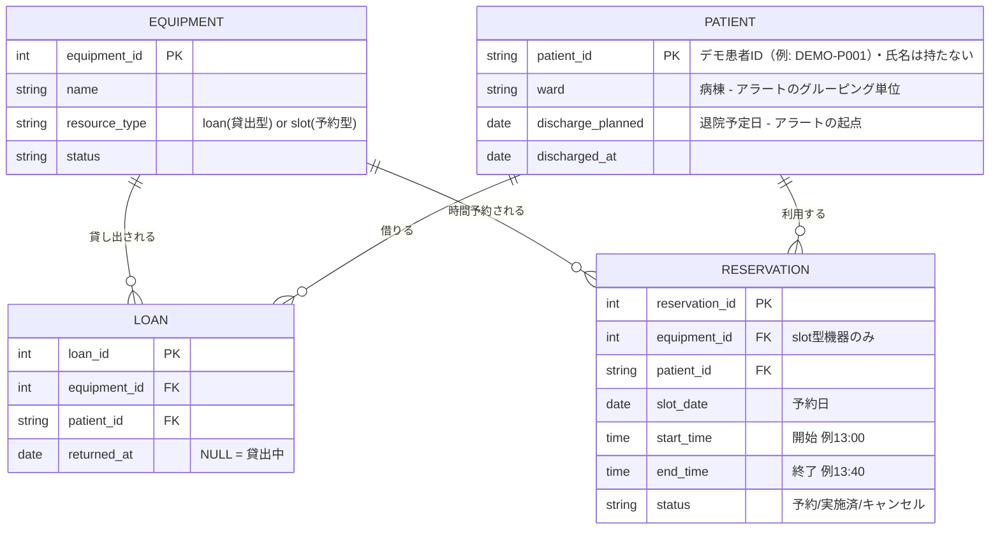

# 業務改善ボード（リハ機器・貸出物品・社用車）

共有して使うものの「今の状況」は、担当者ごとに見えている範囲が違う。自分の担当患者や自分の予定は把握していても、他の担当者の分までは分からない。機器が今空いているか、誰が何を借りたままか、どの車がいつ押さえられているか、全体を把握するためには手間がかかる。

この前提から、3つの業務を「誰が見ても同じ状況が分かるボード」として設計・実装したプロトタイプ。As-Is分析から課題抽出・To-Be設計・実装・テストまでを一連で行った。

**デモ**: https://norio111.github.io/rehab-operations-portfolio/

題材は一般化した想定業務であり、特定の施設固有の人数・配置条件は用いていない。公開版の患者ID・担当者名・病棟名・物品IDはデモ用の識別子に統一しており、実患者・実職員・実施設を示すものではない。画面はサンプルデータで動作し、外部システムとは連携していない。

---

## 設計で判断したこと

**貸出型と予約型を別のものとして扱った**
車椅子のように「借りたら返すまで専有する」備品（loan型）と、物理療法機器のように「時間枠で予約する」備品（slot型）は、見た目は似ていても管理すべきデータの粒度が違う。`resource_type` で明示的に分けたことで、順番待ちボードと退院アラートの両方から同じテーブル設計を再利用できている。

**公平性の起点を来院時刻ではなく「待ち始めた時刻」にした**
来院が早くても、その機器を待ち始めたのが遅ければ先着とは言えない。各項目が「今欲しいもの」になった瞬間を `waitingSince` として保持し、そこから公平性を判定している。

**表示の軸を、現場が実際に投げる問いに合わせた**
初期版は患者軸で組んでいた。患者のカードが並び、それぞれが何を待っているかを持つ形である。しかし実際に動かしてみると、現場で知りたいのは「今どの機器が空いているか」「その機器を誰が待っているか」「あと何分か」であり、いずれも機器軸の問いだった。患者軸のままでは機器の状況と待機列が画面上で離れてしまう。機器ごとの列に組み替え、稼働中・清掃中・待機列を1枚のカードにまとめた。患者軸のビューは「あの患者は今どこまで進んだか」に答えるため切り替えで残している。なお、この変更で業務ロジックには一切手を入れていない。機器軸で必要な関数（`candidatesForEquipment` / `equipmentTiming` / `estimatedWaitForPatient`）は `lib/` に揃っており、表示の組み替えだけで済んだ。

**作りかけの機能を削った**
社用車ボードの初期版（v1）は「患者の訪問予定」を軸に、移動時間バッファを斜線で分離表示する設計だった。車の空き管理に必要なのは占有時間だけだと判断し、v2では主語を「スタッフの車利用」に転換して1ブロック方式へ単純化した。この変更により、車両管理の画面から患者情報そのものを消すことができた。旧試作はローカル保管のみとし、公開対象には含めていない。

**根拠を示せない範囲には踏み込まなかった**
ER図とSQLビューは設計例であり、現在のReact画面はデモデータで動作する。電子カルテ・院内API・RFIDとの連携は実装していない。実運用を想定した構想は末尾に分けて記載している。

---

## 3つのボード

<details>
<summary><b>① リハビリ順番待ちボード</b> — 「先着順」を分解すると複数の判断軸が絡む</summary>

「先着順」という一見シンプルなルールの裏に、実務では以下の制約が隠れていた。

| 制約 | 実装での対応 |
|---|---|
| 機器ごとに台数が違う（ホットパック複数台 / 平行棒1台） | 機器を `capacity`（同時稼働数）で管理 |
| 「まずホットパックをやりたい」という希望順がある患者 | 選択順を希望順として保持し、順番に消化 |
| 順番にこだわらず早く終わりたい患者もいる | 患者ごとに「希望順厳守」「順不同」を切り替え可能に |
| 機器を待ち始めた"本当の"タイミングが患者ごとに違う | `receivedAt`（来院時刻）ではなく `waitingSince` で公平性を判定 |
| 利用時間と清掃時間が機器ごとに違う | 標準利用時間・標準清掃時間を機器ごとに設定し、受付時に変更可能 |
| 清掃状態の更新で通常操作を増やしたくない | 「利用終了」で清掃中へ移し、標準清掃時間の経過後に自動解放。人の操作は清掃延長などの例外時だけに限定 |

実装後のレビューで、「要注意」判定に総滞在時間を使っていたため、機器を長時間使い終えた直後の患者が不当に警告表示されるバグが見つかった。「手が空いてからの時間」を別軸で管理する `idleSince` を導入して解消している。

</details>

<details>
<summary><b>② 退院前 返却チェック</b> — 状態を二値で持つと現場の実態に合わない</summary>

退院3日前までに、未返却の貸出物がある患者だけを抽出する。

```sql
CREATE VIEW discharge_alert AS
SELECT
  p.patient_id, p.ward, p.discharge_planned,
  COUNT(l.loan_id) AS unreturned_loan_count,
  GROUP_CONCAT(e.name, ', ') AS unreturned_equipment
FROM PATIENT p
JOIN LOAN l ON l.patient_id = p.patient_id AND l.returned_at IS NULL
JOIN EQUIPMENT e ON e.equipment_id = l.equipment_id
WHERE p.discharged_at IS NULL
  AND julianday(p.discharge_planned) <= julianday('now', '+3 days')
GROUP BY p.patient_id, p.ward, p.discharge_planned
ORDER BY p.discharge_planned ASC;
```

loan型とslot型を分けたER設計があるため、このビューはJOIN 2本で書けている。

初期プロトタイプは「対応済みボタンを押すと一覧から消える」という一段階のフローだった。レビューで「現場では"電話した"と"まだ返ってきていない"の間に段差がある」という指摘を受け、自分の病棟経験と照らして妥当と判断し、3段階に分けた。

```
未対応 → 回収依頼済み → 返却済み
```

各操作には担当者名と時刻を記録し、申し送りに使える履歴として残す。病棟ごとにグルーピングし、画面上部に「対応が必要な件数」を表示する。

</details>

<details>
<summary><b>③ 社用車 利用ボード</b> — 入力の起点は利用者のタイプで違う</summary>

表計算ソフトで社用車の予定を管理する場面を想定している。

| 表計算での課題 | 実装での対応 |
|---|---|
| 同じ定期利用を各週へ個別入力 | 曜日を複数選択し「毎週繰り返す」で対象日時を一括登録 |
| ダブルブッキングを防ぐ仕組みがない | 登録・ドラッグ移動のたびに全対象週×曜日で衝突判定し、重なる場合は登録自体を中止 |
| 定期予定の一部だけ変えたい週がある（休暇・車検など） | 削除・移動のどちらも「この週だけ / 毎週まとめて」を選択可能に |
| 「今この時間、どの車が空いてるか」を月表から目で探す | 空き枠をタップしてその場で登録完了。「空いてる車を探す」ボタンで即答 |

入力の起点が利用者のタイプによって違うため、2つの入口を用意した。**計画者**（月初にまとめて予定を組む人）は条件が先に決まっているためフォーム入力、**即席利用者**（今から車を使いたい人）は空き枠が起点になるため、タイムテーブルの空白を直接タップする方式としている。

実装上の教訓として、削除確認に `window.confirm` を使ったところ、サンドボックス環境ではダイアログが表示されず暗黙の `false` が返り、確認なしで削除される不具合が発生した。ブラウザ標準ダイアログは実行環境によって無効化されるため、業務アプリでは自前のモーダルで確認フローを実装する必要がある。

</details>

<details>
<summary><b>データ設計（ER図）</b></summary>



</details>

---

## テスト

スケジューリングと衝突判定は、誤るとダブルブッキングや順番飛ばしという業務事故に直結する中核ロジックのため、UIから純関数として `lib/` に切り出し、ユニットテストで保護している。テストランナーはNode.js標準の `node:test` で、外部依存はない。

```
npm test
```

| 対象 | 検証している制約 |
|---|---|
| `lib/rehab-scheduler.mjs` | 機器のcapacity遵守 / 患者は同時1台のみ / fixedモードは希望順を飛ばさない / flexibleモードは空きから消化 / `waitingSince`順の公平性 / 予定終了・超過判定 / 利用終了後の清掃移行 / 清掃時間経過後の自動解放 / 清掃延長 |
| `lib/car-conflicts.mjs` | ぴったり隣接する予約は衝突しない（半開区間の境界） / 1分でも重なれば衝突 / 包含関係の衝突 / キャンセル済み週の解放 / 定期登録の全週判定 / ドラッグ移動時の自己除外 |
| `lib/discharge-returns.mjs` | 回収依頼タスクの生成と状態更新 / 返却完了 / 回収依頼の取消 |

React画面は `lib/` の純関数をimportしており、テストと実画面で同じ業務ロジックを使用している。

GitHub Actions（`.github/workflows/deploy.yml`）でテストを実行し、通った場合のみビルドしてGitHub Pagesへ公開する構成としている。業務ロジックが壊れた状態では公開版が更新されない。

---

## 進め方

実装したものを複数のAIにレビューさせ、指摘のうち何を採用するかを判断する形で進めた。上記のうち `idleSince` の導入、定期予約の削除と移動で操作粒度が揃っていなかった点の修正、返却状態を3段階にした変更は、いずれもレビューで挙がった指摘を検討して取り入れたものである。実装にはClaude Sonnet、設計とコードのレビューにはClaude Fable、業務フロー観点のレビューにはChatGPTを使い分けている。

---

## 技術スタック

- フロントエンド：React（Tailwind CSS）
- データ設計：SQLite / ER図（Mermaid）
- テスト：Node.js標準 `node:test`
- CI：GitHub Actions（テスト通過後にGitHub Pagesへデプロイ）

---

## 今後の構想（未検証）

3つのボードは別々の業務だが、`resource_type`（loan型 / slot型）の視点で見ると、車・リハビリ機器・貸出備品はいずれも「有限のリソースを時間軸上で誰かに割り当てる」という同じ形の問題として扱える。この抽象化がMRI・エコー・会議室など他の資源にも成り立つかは検証しておらず、現時点では仮説である。

実運用を想定した場合の未実装部分は以下のとおり。

```
ER図 → SQLビュー（discharge_alert） → REST API → React画面（現状ここまで）
     → 病棟への通知 → QRコードでの返却処理 → DB更新
```

- ブラウザストレージを用いたセッション永続化
- 利用実績の保持。現在のプロトタイプは削除・変更で過去の記録が消えるが、実務では「先週の水曜、3号車を誰が使っていたか」に答えられることが必要になる（車両の傷や駐車違反の通知など、後から利用者を特定したい場面がある）。表計算の月別シートが自然に持っていたこの性質を、予約とは別の実績テーブルとして設計する
- 病棟側（備品貸出）と外来側（順番待ち）の同一データベースでの連携
- 電子カルテや院内APIからの患者ID・退院予定日の取得、RFID等による貸出・返却の記録
